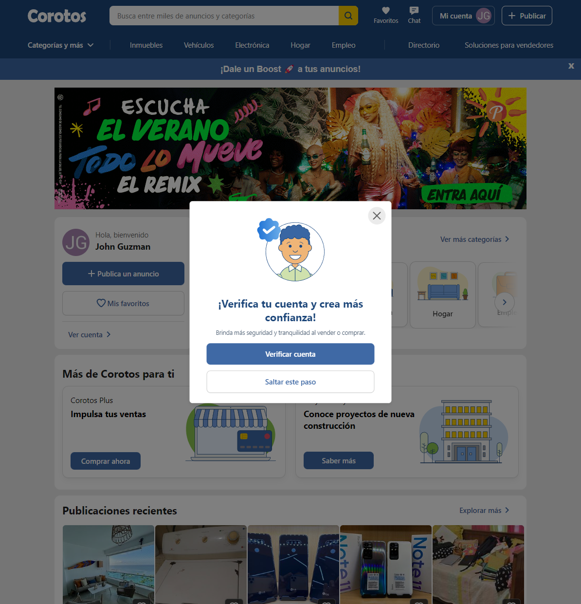
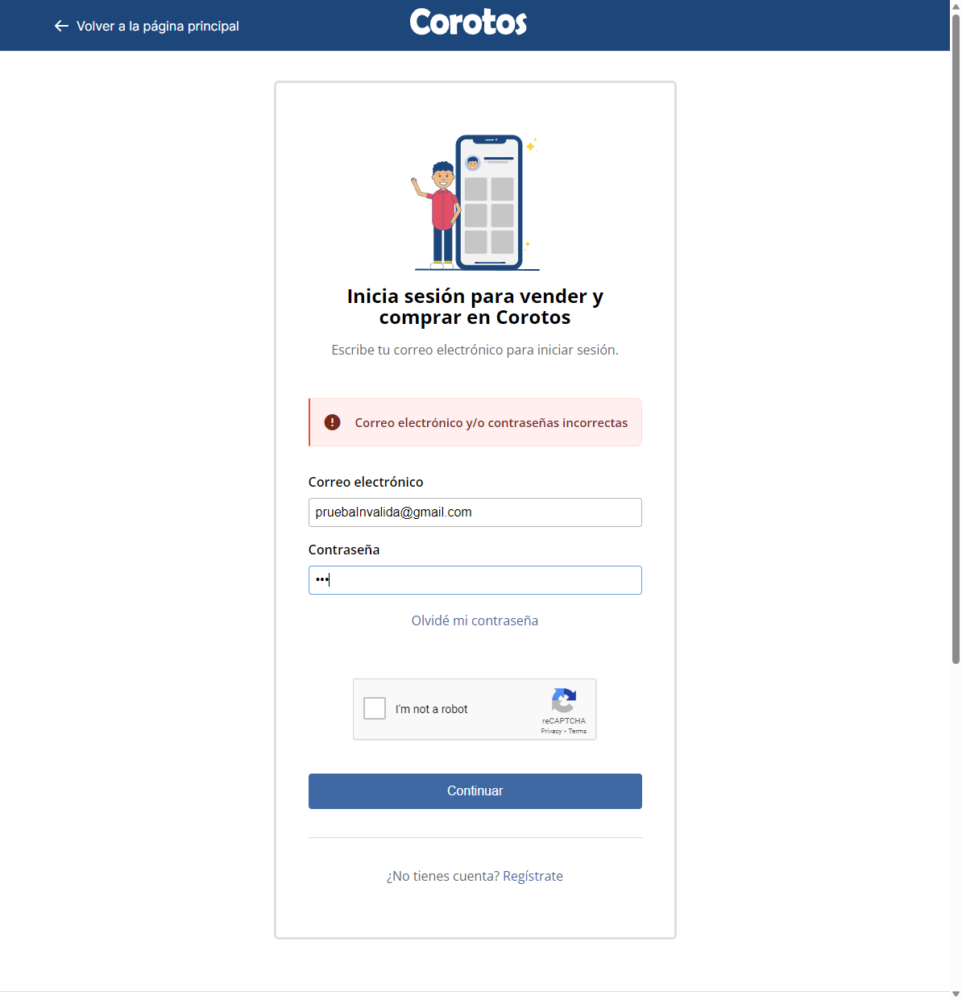
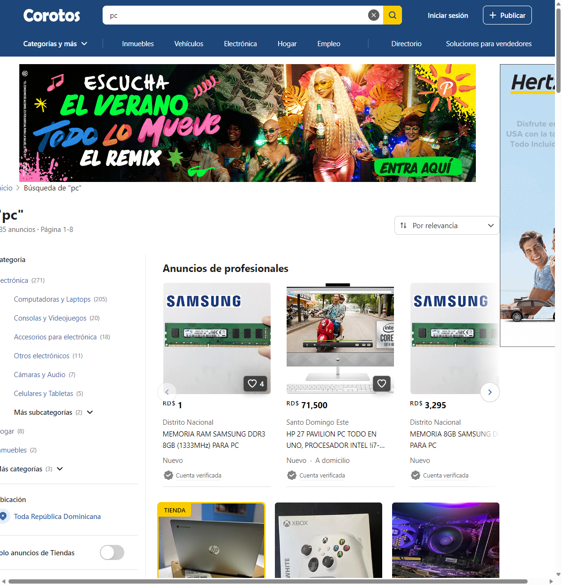
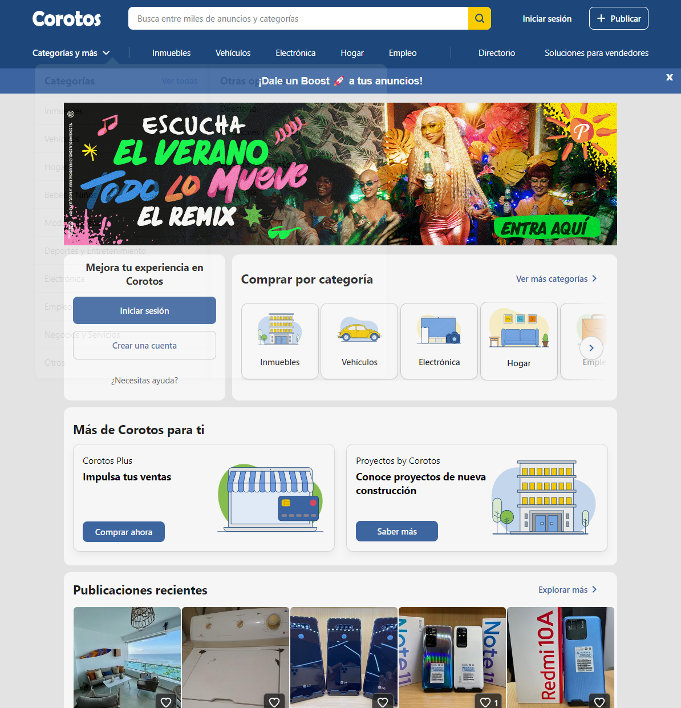
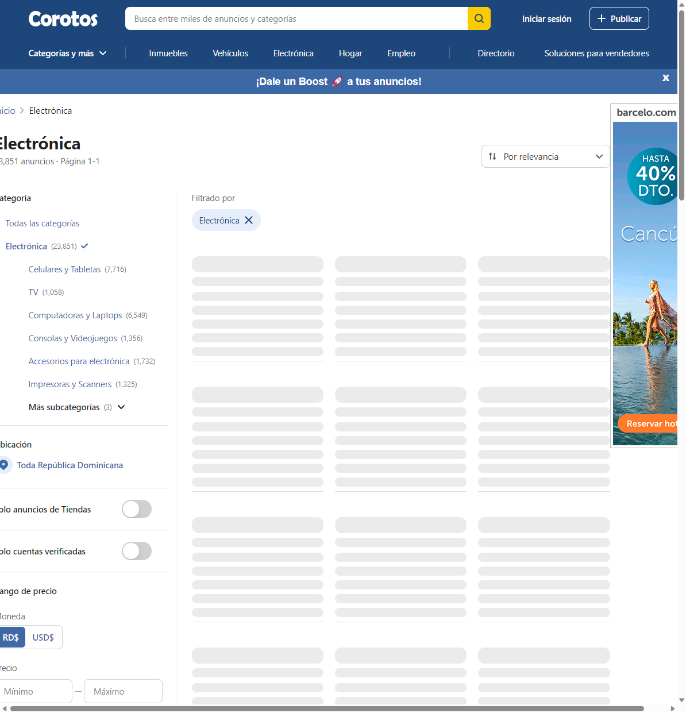
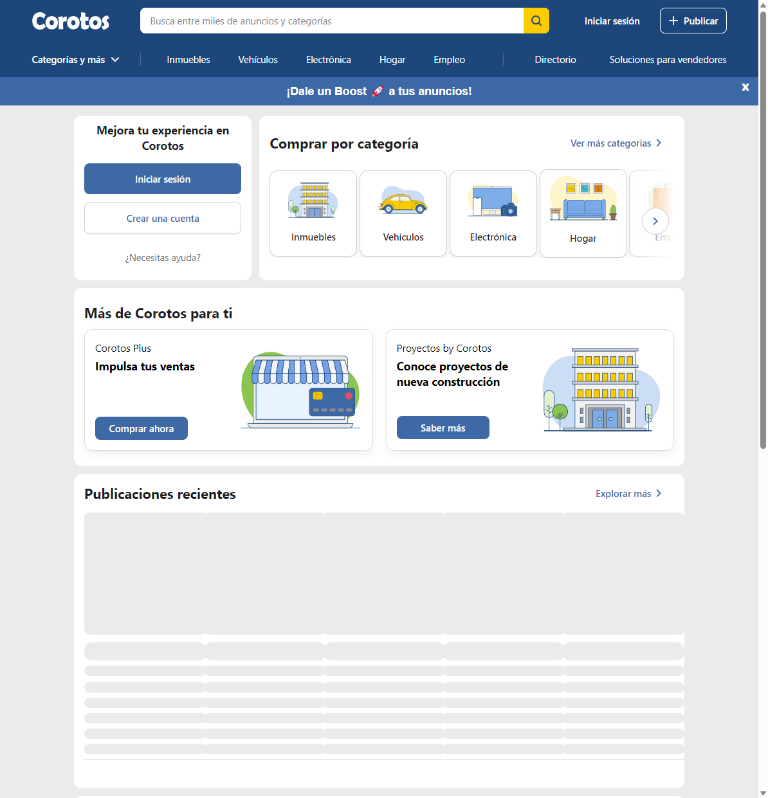
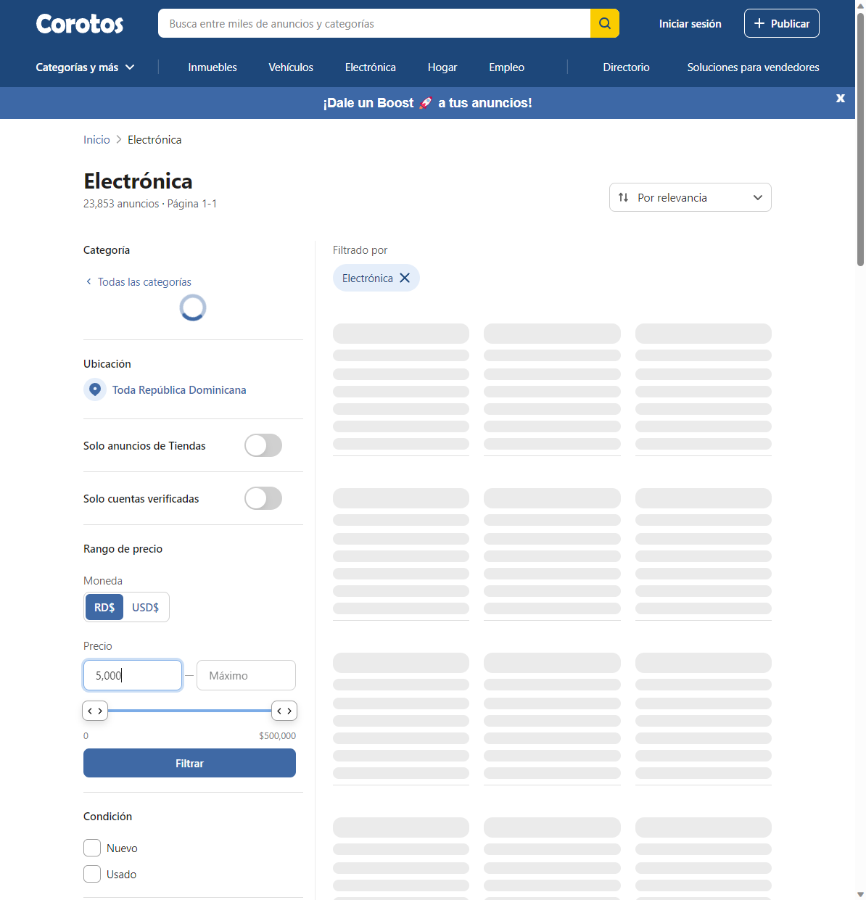
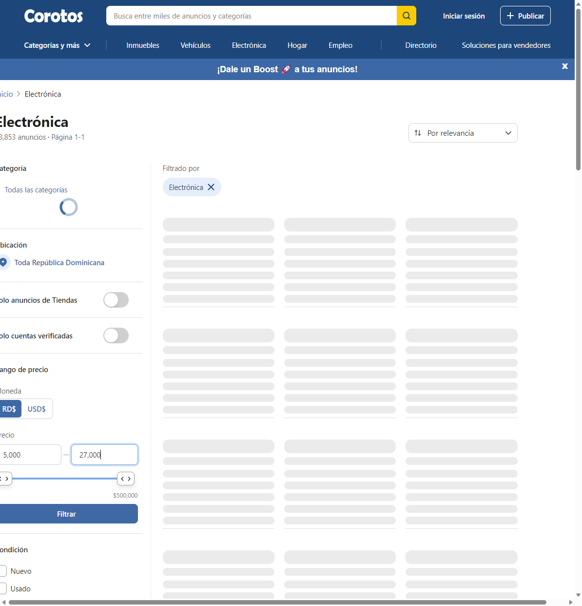
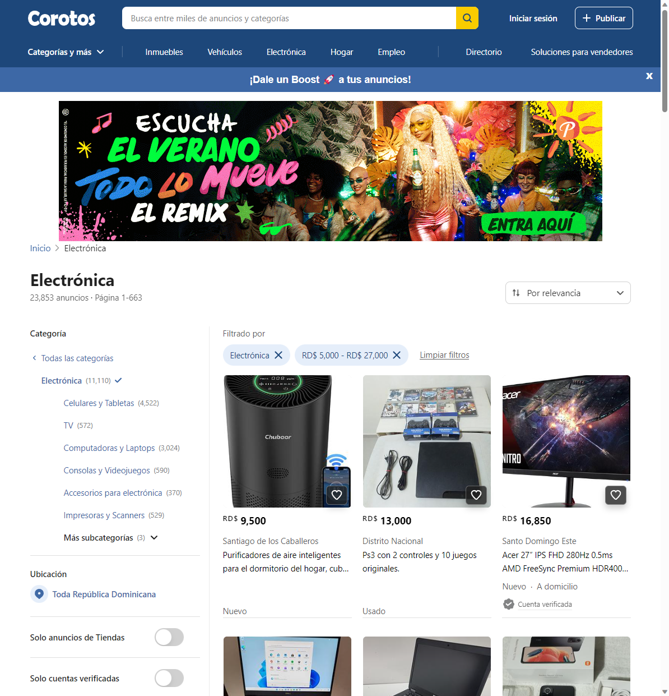

# Pruebas-automaticas
 Aqui estare haciendo algunas pruebas automaticas a la pagina de corotos

				                                       Screenshot de la Primera Prueba - Login
 

                                           Screenshot de la Primera Prueba - Login valida
 

                                           Screenshot de la Primera Prueba.2 - Login invalido
 

                                           Screenshot de la segunda Prueba - Barra de busqueda
 
 

                                          Screenshot de la Segunda Prueba - Barra de busqueda Resultado
 

                                          Screenshot de la Tercera Prueba - Utilizar el filtro para tener diferentes categorias

                                          Screenshot de la tercera Prueba Resultado - Utilizar el filtro para tener diferentes categorias
 

                                          Screenshot de la cuarta Prueba - El logo principal lleve al inicio

                                          Screenshot de la cuarta Prueba Resultado - El logo principal lleve al inicio

                                          Screenshot de la quinta Prueba - Establecer un rango de precios mínimo y máximo

                                          Screenshot de la quinta Prueba resultado- Establecer un rango de precios mínimo y máximo

                                          Screenshot de la quinta Prueba resultado- Establecer un rango de precios mínimo y máximo

